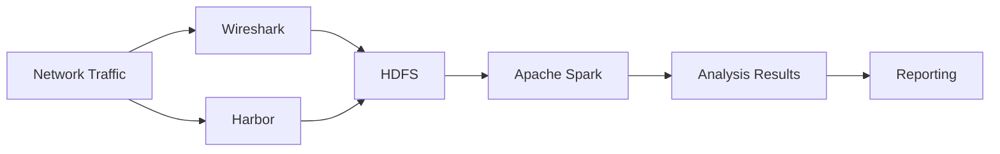
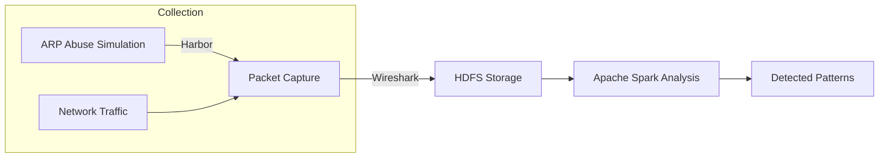

# **Project Proposal: Analysis of Network Traffic Data within the Hadoop Ecosystem**

---

## **Project Overview**

**Title:**
Analysis of Network Traffic Data for Performance and Security Enhancement

**Objective:**
This project aims to collect, analyze, and interpret network traffic data to improve network performance and detect potential security threats. The primary focus is on leveraging the Hadoop ecosystem to process and analyze large-scale network data efficiently.

**Project Selection:**
*No.14 Analysis of Network Traffic Data*

---

## **Scope and Focus**

### **Core Objectives**

- **Detecting Malicious Network Behavior:** Identify anomalies and potential security threats in network traffic.
- **Leveraging Apache Software Foundation Tools:** Utilize tools such as Apache Spark, Apache Flume, HDFS, Hadoop, and Apache Kafka to process and analyze data.
- **Protocol Analysis:** Investigate known vulnerabilities in protocols such as ARP and DHCP

### **Optional Explorations (Time-Permitting)**

- **HDFS Filesystem Best Practices:** Optimize data storage and retrieval.
- **Apache Kafka for Real-Time Dashboards:** Implement real-time data visualization.
- **Apache Spark and Flume Ecosystems:** Explore advanced data processing techniques.

---

## **Integration of External Tools**

### **Rust-Based ARP Abuse Detection**

- **Tool:** [Harbor](https://github.com/Masrkai/Harbor) (Rust-based)
- **Purpose:** Simulate and detect ARP abuse patterns to collect data on malicious behavior.
- **Integration:** Use Harbor to generate ARP traffic patterns, which will be captured and analyzed alongside other network data.

### **Packet Pattern Collection with Wireshark**

- **Process:**
  1. Capture network packets using Wireshark.
  2. Identify and store specific patterns of malicious ARP and DHCP traffic.
  3. Use these patterns as references for detecting protocol abuse in the network.

---

## **Implementation Plan (2-Week Timeline)**

### **Week 1: Setup and Data Collection**

- **Day 1-2: Environment Setup**
  - Install and configure Hadoop, HDFS, Apache Spark, and Apache Flume.
  - Set up Harbor (Rust) for ARP abuse simulation.
  - Install Wireshark for packet capture.

- **Day 3-4: Data Collection**
  - Use Harbor to simulate ARP abuse and capture traffic using Wireshark.
  - Store captured packets and logs in HDFS for analysis.

- **Day 5-7: Initial Analysis**
  - Process collected data using Apache Spark.
  - Identify and document initial patterns of malicious behavior.

---

### **Week 2: Analysis and Reporting**

- **Day 8-10: Deep Analysis**
  - Use Apache Spark to analyze stored packet patterns.
  - Compare captured data with known ARP and DHCP vulnerabilities.
  - Refine detection logic based on findings.

- **Day 11-12: Integration and Testing**
  - Integrate Harbor and Wireshark data into the Hadoop ecosystem.
  - Test the system for accuracy in detecting malicious patterns.

- **Day 13-14: Documentation and Final Review**
  - Document all findings, including detected patterns and system performance.
  - Prepare a final report with recommendations for network security improvements.

---

## **Tools and Technologies**

| **Tool/Technology**       | **Purpose**                                      |
|---------------------------|--------------------------------------------------|
| Hadoop                    | Distributed storage and processing               |
| HDFS                      | Storage of network traffic data                  |
| Apache Spark              | Data processing and analysis                     |
| Apache Flume              | Data ingestion from various sources              |
| Apache Kafka              | Real-time data streaming (optional)             |
| Harbor (Rust)             | ARP abuse simulation and data collection         |
| Wireshark                 | Packet capture and pattern identification        |

---

## **Expected Outcomes**

- A functional system for collecting and analyzing network traffic data within the Hadoop ecosystem.
- Identification of malicious patterns in ARP and DHCP protocols.
- Documentation of findings, including detected vulnerabilities and recommendations for mitigation.
- Optional: Real-time dashboard for monitoring network traffic (if time permits).

---

## **Constraints and Assumptions**

- **Time Constraint:** The project is limited to a 2-week timeline. Implementation will focus on core objectives, with optional features (e.g., Kafka dashboards) included only if time allows.
- **Hadoop Ecosystem Focus:** All primary development will use Hadoop, HDFS, Spark, and Flume. Other tools (e.g., Kafka) are optional.
- **Adaptability:** The final implementation may vary based on time and resource availability.

---

## **UML Diagrams (Mermaid Syntax)**

### **System Architecture**

### **Data Flow**

